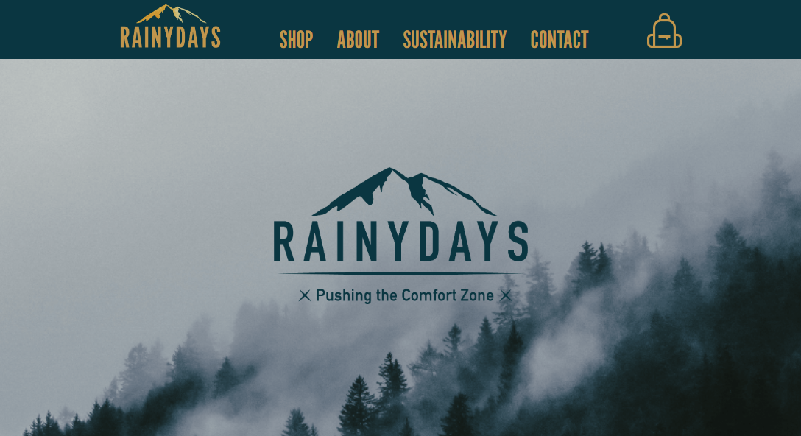

# RainyDays ☔

## 📖 Table of Contents
1. [Introduction](#introduction)
2. [Features](#features)
3. [Technologies Used](#technologies-used)
4. [Getting Started](#getting-started)
5. [Project Structure](#project-structure)
6. [Future Improvements](#future-improvements)
7. [Acknowledgements](#acknowledgements)

---

## 🌧 Introduction
RainyDays is a cozy and responsive e-commerce site designed to offer customers high-quality rain jackets and outerwear. The site features a modern and minimalistic design, making it easy to navigate and find the perfect outerwear for every rainy day! 🌂

Visit the live site here: [rainydays-idatold.netlify.app](https://rainydays-idatold.netlify.app/) 🌐

## 🌟 Features
- 🛍️ Responsive e-commerce site.
- 💧 Intuitive navigation and product filtering.
- 🌈 Product sorting and checkout functionality.
- 🧑‍💻 User-friendly interface and design.
- 🏷️ Detailed product pages with descriptions and pricing.

## 🛠 Technologies Used
- HTML 📝
- CSS 🎨
- JavaScript ⚙️
- Netlify for hosting 🌐

## 🚀 Getting Started
Simply visit the live website and start exploring the product catalog!

## 🗂 Project Structure
- `/css`: Contains all style files for the project. 🎨
- `/js`: JavaScript files for added functionality. ⚙️
- `/images`: All the visuals and product images used on the site. 📸
- `index.html`: The main entry point of the site. 🏠

## 🔮 Future Improvements
- 🛍️ Enhance the product recommendations feature.
- 📦 Add a more personalized shopping experience (e.g., wishlists or user profiles).
- 📊 Improve performance for faster loading times and smoother navigation.

## 💖 Acknowledgements
A huge shout-out to my coffee ☕, inspiration from the rainy weather 🌧, and all the tutorials and coder besties that kept this project running smoothly! 💖
